# Blockchain-Auth Diagrams (Improved Readability)

This document contains visual representations of the Blockchain-Auth project using Mermaid diagrams with improved readability.

## System Architecture Diagram

```mermaid
flowchart TB
    User([👤 User/Client])
    
    subgraph BackendServer["Backend Server"]
        direction TB
        Express["🖥️ Express.js Server"]
        Middleware["🔒 Authentication Middleware"]
        Routes["🛣️ API Routes"]
        BCService["⛓️ Blockchain Service"]
    end
    
    subgraph DataStorage["Data Storage"]
        direction TB
        MongoDB[("💾 MongoDB")]
        TokenRegistry["📝 TokenRegistry<br/>Smart Contract"]
    end
    
    subgraph BlockchainNetwork["Blockchain Network"]
        direction TB
        Ethereum{"🌐 Ethereum Network"}
        Validators[("👥 Validators")]
        Consensus["🔄 Consensus<br/>Mechanism"]
    end
    
    User <--> Express
    Express --> Routes
    Routes --> Middleware
    Middleware --> MongoDB
    Middleware --> BCService
    BCService --> TokenRegistry
    TokenRegistry --> Ethereum
    Ethereum <--> Validators
    Validators <--> Consensus
    
    classDef default fontSize:14px
    classDef server fill:#FF9AFF,stroke:#333,stroke-width:2px,color:black,font-weight:bold
    classDef storage fill:#9999FF,stroke:#333,stroke-width:2px,color:black,font-weight:bold
    classDef blockchain fill:#99FF99,stroke:#333,stroke-width:2px,color:black,font-weight:bold
    classDef user fill:#FFFF99,stroke:#333,stroke-width:2px,color:black,font-weight:bold
    
    class User user
    class Express,Middleware,Routes,BCService server
    class MongoDB,TokenRegistry storage
    class Ethereum,Validators,Consensus blockchain
    
    style BackendServer fill:#FFD6FF,stroke:#333,stroke-width:2px,color:black,font-weight:bold
    style DataStorage fill:#D6D6FF,stroke:#333,stroke-width:2px,color:black,font-weight:bold
    style BlockchainNetwork fill:#D6FFD6,stroke:#333,stroke-width:2px,color:black,font-weight:bold
```

## Authentication Flow Diagram

```mermaid
sequenceDiagram
    participant User as 👤 User
    participant Server as 🖥️ Express Server
    participant DB as 💾 MongoDB
    participant JWT as 🔑 JWT Service
    participant BC as ⛓️ Blockchain (TokenRegistry)
    
    %% Registration Flow
    User->>Server: POST /signup (username, password)
    Server->>Server: Validate request
    Server->>DB: Check if user exists
    DB-->>Server: User exists? (yes/no)
    alt User exists
        Server-->>User: 400 - User already exists
    else User doesn't exist
        Server->>DB: Create new user with hashed password
        DB-->>Server: User created
        Server->>JWT: Generate JWT token
        JWT-->>Server: JWT token
        Server->>BC: Register token on blockchain
        Note over Server,BC: Hash token and set expiry time
        BC-->>Server: Transaction receipt (gas used, etc.)
        Server-->>User: 200 - User registered + Set cookie
    end
    
    %% Login Flow
    User->>Server: POST /login (username, password)
    Server->>DB: Find user
    DB-->>Server: User data
    alt Invalid credentials
        Server-->>User: 401 - Invalid credentials
    else Valid credentials
        Server->>JWT: Generate JWT token
        JWT-->>Server: JWT token
        Server->>BC: Register token on blockchain
        BC-->>Server: Transaction receipt
        Server-->>User: 200 - Login successful + Set cookie
    end
    
    %% Protected Route Access
    User->>Server: GET /protected (with cookie)
    Server->>JWT: Verify JWT token
    JWT-->>Server: Token valid? (yes/no)
    Server->>DB: Find user
    DB-->>Server: User exists? (yes/no)
    Server->>BC: Validate token on blockchain
    BC-->>Server: Token valid? (yes/no)
    alt Any validation fails
        Server-->>User: 401 - Unauthorized
    else All validations pass
        Server->>Server: Process request
        Server-->>User: 200 - Protected resource
    end
    
    %% Logout Flow
    User->>Server: POST /logout (with cookie)
    Server->>BC: Remove token from blockchain
    BC-->>Server: Transaction receipt
    Server-->>User: 200 - Logged out + Clear cookie
```

## Consensus Mechanism Comparison

## Token Lifecycle Diagram

## Dual-Layer Security Model

```mermaid
graph TD
    User([👤 User/Client])
    
    subgraph Layer1["Layer 1: Traditional Authentication"]
        direction TB
        JWT["🔑 JWT Validation"]
        Cookie["🍪 HTTP-Only Cookie"]
        DB[("💾 User Database")]
    end
    
    subgraph Layer2["Layer 2: Blockchain Authentication"]
        direction TB
        SC["📄 Smart Contract"]
        BV["⛓️ Blockchain Validation"]
        Consensus["🔄 Consensus Mechanism"]
    end
    
    User --> Cookie
    Cookie --> JWT
    JWT --> DB
    JWT --> SC
    SC --> BV
    BV --> Consensus
    
    %% Advantages
    Adv1["🛡️ Enhanced Security"]
    Adv2["📜 Immutable Audit Trail"]
    Adv3["🛑 DoS Resistance"]
    Adv4["🔀 No Single Point of Failure"]
    
    Consensus --> Adv1
    Consensus --> Adv2
    Consensus --> Adv3
    Consensus --> Adv4
    
    classDef default fontSize:14px,color:black
    classDef traditional fill:#FF9AFF,stroke:#333,stroke-width:2px,color:black,font-weight:bold
    classDef blockchain fill:#99FF99,stroke:#333,stroke-width:2px,color:black,font-weight:bold
    classDef advantage fill:#FFFF99,stroke:#333,stroke-width:2px,color:black,font-weight:bold
    classDef user fill:#FFCC99,stroke:#333,stroke-width:2px,color:black,font-weight:bold
    
    class User user
    class JWT,Cookie,DB traditional
    class SC,BV,Consensus blockchain
    class Adv1,Adv2,Adv3,Adv4 advantage
    
    style Layer1 fill:#FFD6FF,stroke:#333,stroke-width:2px,color:black,font-weight:bold
    style Layer2 fill:#D6FFD6,stroke:#333,stroke-width:2px,color:black,font-weight:bold
```

## Performance Metrics Tracking

```mermaid
graph LR
    Request["📥 API Request"] --> Start["⏱️ Start Timer"]
    
    Start --> JWT["🔑 JWT Validation"]
    JWT --> |Time Tracked| JWTTime["⏱️ JWT Validation Time"]
    
    JWT --> DB["💾 Database Operations"]
    DB --> |Time Tracked| DBTime["⏱️ DB Query Time"]
    
    DB --> BC["⛓️ Blockchain Operations"]
    BC --> |Time Tracked| BCTime["⏱️ Blockchain Validation Time"]
    BC --> |Gas Tracked| Gas["⛽ Gas Used"]
    
    BCTime --> End["⏱️ End Timer"]
    Gas --> End
    DBTime --> End
    JWTTime --> End
    
    End --> Total["⏱️ Total Processing Time"]
    
    Total --> Response["📤 API Response with Metrics"]
    
    classDef default fontSize:14px,color:black
    classDef operation fill:#9999FF,stroke:#333,stroke-width:2px,color:black,font-weight:bold
    classDef metric fill:#99FF99,stroke:#333,stroke-width:2px,color:black,font-weight:bold
    classDef endpoint fill:#FFCC99,stroke:#333,stroke-width:2px,color:black,font-weight:bold
    classDef timer fill:#FFFF99,stroke:#333,stroke-width:2px,color:black,font-weight:bold
    
    class Request,Response endpoint
    class JWT,DB,BC operation
    class JWTTime,DBTime,BCTime,Gas,Total metric
    class Start,End timer
```

These diagrams provide visual representations of the key components and processes in the Blockchain-Auth project with improved readability. 